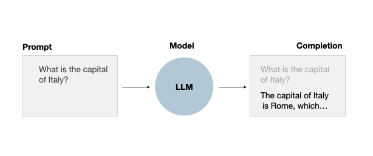
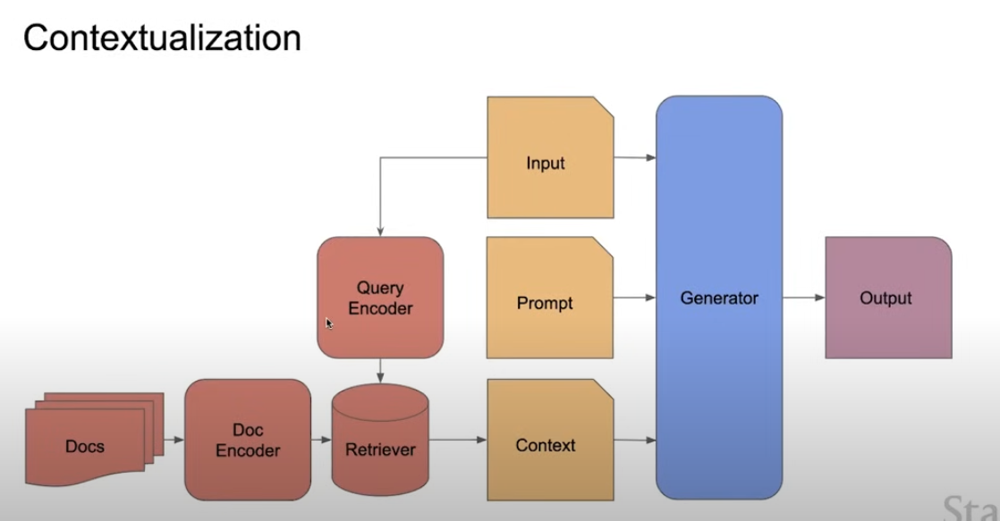
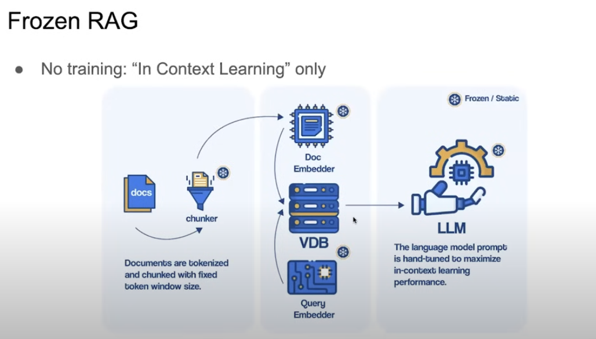
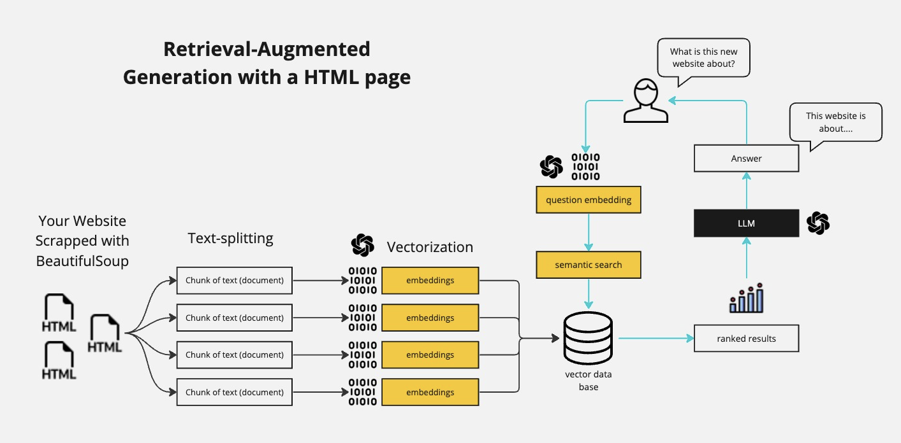
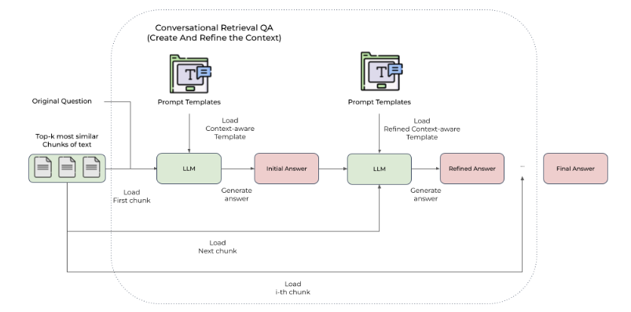
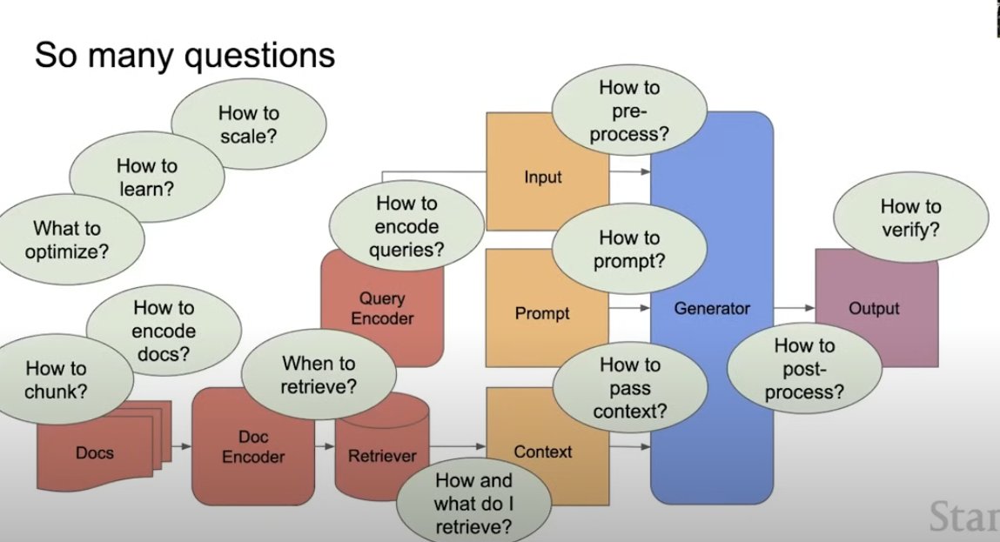
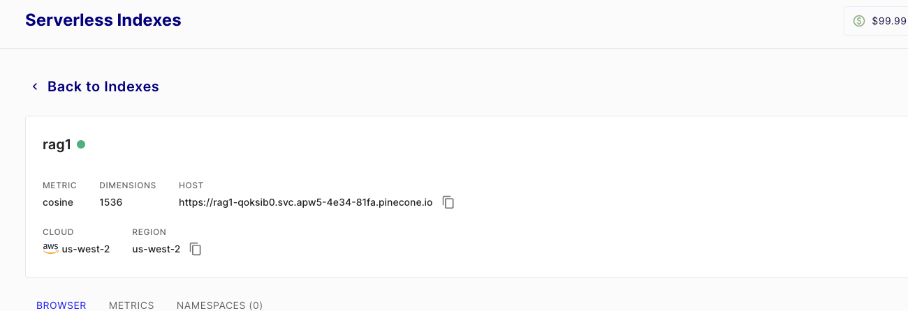
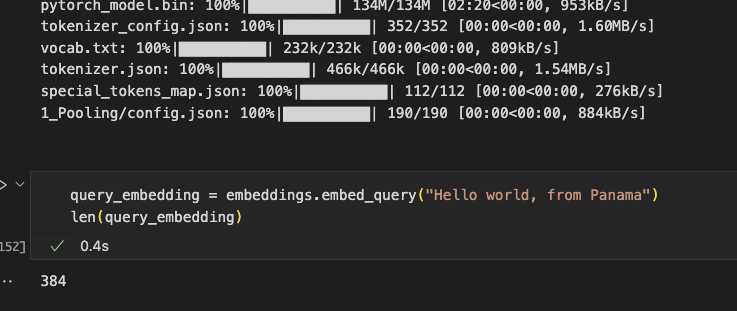

# Chat with any website using LangChain, Pinecone and Streamlit

- https://www.youtube.com/watch?v=nAKhxQ3hcMA&ab_channel=PradipNichite

## Problems of large pre-trained language models

Large pre-trained language models have been shown to store factual knowledge in their parameters, and achieve state-of-the-art results when fine-tuned on downstream NLP tasks. However, their ability to access and precisely manipulate knowledge is still limited, and hence on knowledge-intensive tasks, their performance lags behind task-specific architectures [5].

### Why are LLMs more accurate with documents rather than pure hallucination from general context?
This is important because what is happening is that some documents are indexed and retrieved, so the LLM can sum up them. But why is that more accurate than an hallucination? LLMs are only able to hallucinate or also doing other stuff such as summing up coherently an existing text?

RAG can be particularly useful when the pre-trained language model alone may not have the necessary information to generate accurate or sufficiently detailed responses since standard general language models are not capable of accessing post-training/external information directly [2].

In conclusion RAGs find their true motivation, in delimiting the LLM to act only on a limited set of data, making fine-tuning not strictly necessary, resulting in time saving and cost saving, even if there is a threshold where fine-tuning would be preferable (the bot must be generalistic).

## RAG: Retrieval-Augmented Generation

A RAG (Retrieval-Augmented Generation) application refers to a class of generative models that enhance their output by incorporating external information. The process involves two main steps: retrieval and generation. First, given a prompt or query, the model retrieves relevant information from a large dataset or knowledge base. This retrieved context is then attached to the original prompt, effectively expanding the model's context window with pertinent information. In the second step, the generative component of the model uses this augmented prompt to generate a response or output [Original ChatGPT].

Paradigm:
- Closed book vs open book [4]
- Grounding means having less hallucinations, and that it's possible to do citacions and attributions by pointing back to the source [4]

https://www.youtube.com/watch?v=tcqEUSNCn8I&ab_channel=pixegami

Typical RAG setup:

- **Retrieval**: Given a user query or prompt, the system searches through a knowledge source (a vector store with text embeddings) to find relevant documents or text snippets. The retrieval component typically employs some form of similarity or relevance scoring to determine which portions of the knowledge source are most pertinent to the input query [2].

- **Generation**: The retrieved documents or snippets are then provided to a large language model, which uses them as additional context for generating a more detailed, factual, and relevant response [2].

## Engineering RAG

## Document indexing

## Semantic search (or relevant introduction for RAGs)

https://blog.dataiku.com/semantic-search-an-overlooked-nlp-superpower

## Chat interface with Streamlit

## Embeddings: OpenAIEmbeddings() or SentenceTransformerEmbeddings()?

Embeddings dimension depend from the embedding model, that has to match Pinecone Vector Store dimension

## Retrieving answers

## Langchain Memory with LLMs for Advanced Conversational AI and Chatbots

https://blog.futuresmart.ai/langchain-memory-with-llms-for-advanced-conversational-ai-and-chatbots

## Environment requirements

## Deploy the app

## References

1. https://www.youtube.com/watch?v=bupx08ZgSFg&ab_channel=AlejandroAO-Software%26Ai

2. https://www.anaconda.com/blog/how-to-build-a-retrieval-augmented-generation-chatbot

3. [General structure of this post](https://github.com/umbertogriffo/rag-chatbot?tab=readme-ov-file)

4. [Stanford CS25: V3 I Retrieval Augmented Language Models](https://www.youtube.com/watch?v=mE7IDf2SmJg&t=16s&ab_channel=StanfordOnline)

5. [Retrieval-Augmented Generation for Knowledge-Intensive NLP Tasks
](https://doi.org/10.48550/arXiv.2005.11401)

6. [Open Source LLMs: Viable for Production or a Low-Quality Toy?](https://www.anyscale.com/blog/open-source-llms-viable-for-production-or-a-low-quality-toy)