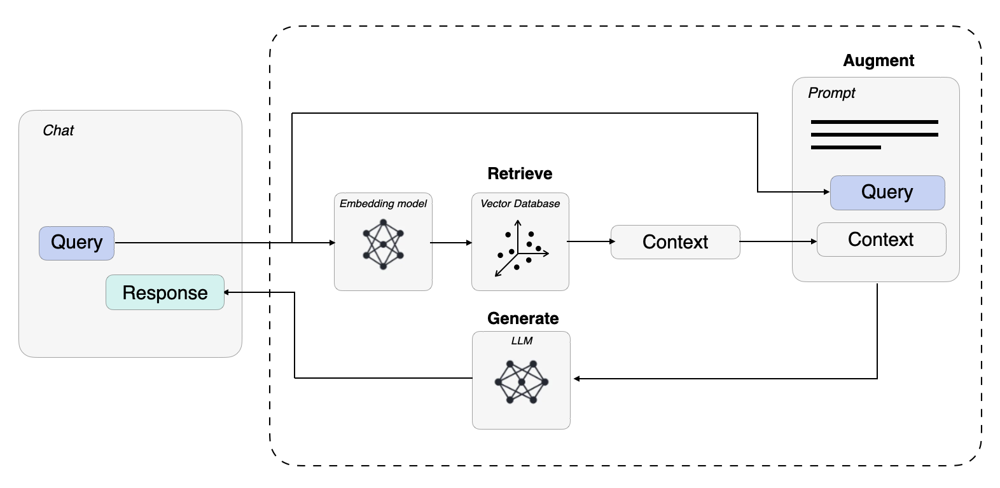

# 🌐 RAG Web Page Chatbot

[](https://www.python.org/downloads/)
[](https://streamlit.io/)
[](https://www.langchain.com/)
[](https://opensource.org/licenses/MIT)

A production-ready **Retrieval-Augmented Generation (RAG)** chatbot that enables intelligent conversations about any webpage's content. Built with LangChain, OpenAI GPT-4, Pinecone vector database, and Streamlit.



## 📚 Documentation

- **[Getting Started](GETTING_STARTED.md)** - Quick setup guide (5 minutes)
- **[API Key Setup](API_KEY_SETUP.md)** - Configure keys for deployment and local use
- **[Deployment Guide](DEPLOYMENT.md)** - Deploy to Streamlit Cloud

## 🎯 Overview

This application demonstrates a complete RAG pipeline that:
- 📥 **Loads up to 5 webpages** per session
- 🔢 **Embeds** text chunks into 384-dimensional vectors
- 🗄️ **Stores** embeddings in Pinecone with session isolation
- 🔍 **Retrieves** semantically relevant context for queries
- 🤖 **Generates** accurate, context-aware responses using GPT-4
- 🔄 **Maintains conversation history** for follow-up questions

Unlike traditional chatbots, this RAG implementation **grounds** responses in actual webpage content, dramatically reducing hallucinations and improving factual accuracy.

## ✨ Key Features

- **Multi-Page Support**: Load up to 5 webpages per session
- **Session Isolation**: Each session uses unique Pinecone namespace
- **Semantic Search**: Finds relevant content based on meaning, not keywords
- **Context-Aware Chat**: Maintains conversation history for follow-ups
- **Query Refinement**: Automatically reformulates queries for better retrieval
- **Scalable Storage**: Pinecone serverless infrastructure
- **Clean UI**: Responsive Streamlit interface with restart functionality
- **Production Ready**: Error handling, logging, and dual API key support

## 🏗️ Architecture

### RAG Pipeline Flow

```
User Query
    ↓
Query Refinement (GPT-4)
    ↓
Embedding Generation (SentenceTransformer)
    ↓
Semantic Search (Pinecone)
    ↓
Context Retrieval (Top-K Chunks)
    ↓
Response Generation (GPT-4 + Context)
    ↓
User Response
```

### Technical Stack

| Component | Technology | Purpose |
|-----------|-----------|---------|
| **Frontend** | Streamlit | Interactive web interface |
| **LLM** | OpenAI GPT-4 | Query refinement & response generation |
| **Embeddings** | all-MiniLM-L12-v2 | Text-to-vector conversion (384 dimensions) |
| **Vector DB** | Pinecone | Scalable similarity search |
| **Framework** | LangChain | LLM orchestration & memory management |
| **Chunking** | RecursiveCharacterTextSplitter | Intelligent document segmentation |

## 📋 Prerequisites

- Python 3.10 or higher
- OpenAI API key ([Get one here](https://platform.openai.com/api-keys))
- Pinecone API key ([Sign up here](https://www.pinecone.io/))
- Basic understanding of Python and virtual environments

## 🚀 Quick Start

### 1. Clone the Repository

```bash
git clone https://github.com/yourusername/rag-webpage-chatbot.git
cd rag-webpage-chatbot
```

### 2. Set Up Environment

**Option A: Using UV (Recommended - 10x faster!)**
```bash
# Install UV
curl -LsSf https://astral.sh/uv/install.sh | sh

# Create venv and install dependencies
uv venv
source .venv/bin/activate  # macOS/Linux
uv pip install -r requirements.txt
```

**Option B: Using pip (Traditional)**
```bash
# Create virtual environment
python -m venv venv

# Activate virtual environment
source venv/bin/activate  # macOS/Linux
# or: venv\Scripts\activate  # Windows

# Install dependencies
pip install -r requirements.txt
```

**For detailed setup instructions**, see **[GETTING_STARTED.md](GETTING_STARTED.md)**

### 3. Configure Environment Variables

Create a `.env` file in the project root:

```bash
cp .env.example .env
```

Edit `.env` and add your API keys:

```env
OPENAI_API_KEY=sk-your-openai-api-key-here
PINECONE_API_KEY=your-pinecone-api-key-here
```

### 4. Run the Application

```bash
streamlit run src/main.py
```

The app will open in your browser at `http://localhost:8501`

## 💻 Usage

1. **Add Webpages**: Enter URLs in the sidebar (up to 5 pages per session)
2. **Wait for Processing**: Each page takes ~10-30 seconds to process
3. **Start Chatting**: Ask questions about the loaded content
4. **Add More Pages**: Load additional related pages for better context
5. **Restart Session**: Click "🔄 Restart Session" to clear and start fresh
6. **Explore Details**: Expand "Query Processing Details" to see query refinement

### Example Queries

```
"What are the main topics covered on this page?"
"Summarize the key points in bullet format"
"What does it say about [specific topic]?"
"Compare [concept A] and [concept B] from this page"
```

## 📁 Project Structure

```
rag-webpage-chatbot/
├── src/
│   ├── main.py              # Streamlit application entry point
│   └── utils.py             # Utility functions (chunking, search, refinement)
├── docs/                    # Documentation images and resources
├── .env.example             # Environment variable template
├── .gitignore              # Git ignore rules
├── requirements.txt         # Python dependencies
├── README.md               # This file
└── LICENSE                 # MIT License
```

## 🔧 Configuration

### Customizing Chunk Size

In [src/utils.py](src/utils.py#L101-L104), adjust chunking parameters:

```python
text_splitter = RecursiveCharacterTextSplitter(
    chunk_size=1000,      # Maximum characters per chunk
    chunk_overlap=200     # Overlap between chunks (preserves context)
)
```

**Guidelines:**
- Smaller chunks (500-800): Better for precise retrieval
- Larger chunks (1000-1500): Better for contextual understanding
- Overlap (100-200): Prevents information loss at chunk boundaries

### Adjusting Retrieval Count

In [src/utils.py](src/utils.py#L133), modify `top_k`:

```python
result = index.query(
    vector=input_em,
    top_k=3,  # Number of chunks to retrieve
    include_metadata=True
)
```

### Changing LLM Model

In [src/main.py](src/main.py#L153-L156), update the model:

```python
llm = ChatOpenAI(
    model_name='gpt-4',      # Options: gpt-4, gpt-4-turbo, gpt-3.5-turbo
    temperature=0.7          # 0.0 = deterministic, 1.0 = creative
)
```

## 🧠 How It Works: Deep Dive

### 1. Document Loading and Chunking

When you enter a URL, the application:

```python
# Load webpage content
loader = WebBaseLoader(url)
document = loader.load()

# Split into chunks
text_splitter = RecursiveCharacterTextSplitter(chunk_size=1000, chunk_overlap=0)
document_chunks = text_splitter.split_documents(document)
```

**Why chunk?** Large language models have context limits. Chunking allows:
- Precise retrieval of relevant sections
- Better semantic matching
- Efficient storage and querying

### 2. Embedding Generation

Each chunk is converted to a 384-dimensional vector:

```python
embeddings = SentenceTransformerEmbeddings(model_name="all-MiniLM-L12-v2")
```

These vectors capture **semantic meaning**, enabling similarity search based on concepts, not just keywords.

### 3. Vector Storage in Pinecone

Chunks are stored in Pinecone with metadata:

```python
docsearch = PineconeVectorStore.from_documents(
    website_chunks,
    embeddings,
    index_name='rag2'
)
```

Pinecone index configuration:
- **Dimension**: 384 (matches embedding model)
- **Metric**: Cosine similarity
- **Spec**: AWS us-east-1 serverless
- **Namespace**: Unique per session for isolation

### 4. Query Refinement

User queries are contextually enhanced:

```python
def query_refiner(conversation, query):
    # Uses GPT-4 to reformulate query based on conversation history
    response = openai.ChatCompletion.create(
        model="gpt-4",
        messages=[
            {"role": "system", "content": "Formulate a relevant question..."},
            {"role": "user", "content": f"Conversation: {conversation}\nQuery: {query}"}
        ]
    )
    return response.choices[0].message['content']
```

**Example:**
- **User**: "What is RAG?"
- **Bot**: [explains RAG]
- **User**: "How does it work?" ← vague
- **Refined**: "How does Retrieval-Augmented Generation work?" ← specific

### 5. Semantic Search

The refined query is embedded and used to find similar chunks:

```python
input_em = model.encode(refined_query).tolist()
result = index.query(vector=input_em, top_k=3, include_metadata=True)
```

Returns the 3 most semantically similar chunks based on **cosine similarity**.

### 6. Response Generation

GPT-4 generates a response using retrieved context:

```python
response = conversation.predict(
    input=f"Context:\n{context}\n\nQuery:\n{refined_query}"
)
```

The model is instructed to:
- Prioritize provided context
- Indicate when using general knowledge
- Format long answers with bullet points

## 🎓 Understanding RAG

### Why RAG?

Large Language Models (LLMs) like GPT-4 are trained on data up to a certain date and cannot access:
- Current information
- Private/proprietary documents
- Specific webpage content

**RAG solves this** by augmenting the LLM's context with retrieved, relevant information.

### Closed Book vs. Open Book

| Aspect | Closed Book (Standard LLM) | Open Book (RAG) |
|--------|---------------------------|-----------------|
| **Knowledge Source** | Training data only | External documents |
| **Freshness** | Static (training cutoff) | Dynamic (real-time) |
| **Hallucinations** | Higher risk | Lower risk (grounded) |
| **Verifiability** | Difficult | Easy (citations) |
| **Domain Specificity** | General | Specialized |

### Benefits of Grounding

By retrieving relevant context before generation, RAG:
1. **Reduces hallucinations**: Responses are based on actual content
2. **Enables citations**: Can point to source chunks
3. **Improves accuracy**: Factual information is directly referenced
4. **Saves costs**: No need for expensive fine-tuning

## 🚢 Deployment

### Two Ways to Use This App

#### Option 1: Use the Live Demo (No Setup Required)

**For End Users**: Simply visit the deployed app and start chatting - no API keys needed!

- 🌐 **Live Demo**: [Your Deployed App URL]
- 🔑 **API Keys**: Provided by the app (using developer's keys)
- 💰 **Cost**: Free for you to use
- ⚡ **Setup Time**: 0 minutes

*Note: The live demo uses the developer's API keys. Please use responsibly!*

#### Option 2: Clone and Self-Host (Full Control)

**For Developers**: Clone the repository and use your own API keys.

- 📦 **Cost**: You pay for your own API usage
- 🔧 **Customization**: Full control over the code
- 🚀 **Deployment**: Deploy to your own Streamlit Cloud account

See [DEPLOYMENT_GUIDE.md](DEPLOYMENT_GUIDE.md) for detailed instructions.

### Deploy Your Own Instance to Streamlit Cloud

1. **Push to GitHub**:
   ```bash
   git init
   git add .
   git commit -m "Initial commit"
   git remote add origin https://github.com/yourusername/rag-chatbot.git
   git push -u origin main
   ```

2. **Deploy on Streamlit Cloud**:
   - Go to [share.streamlit.io](https://share.streamlit.io/)
   - Click "New app"
   - Connect your GitHub repository
   - Set main file path: `src/main.py`
   - Add **your API keys** in "Advanced settings" → "Secrets":
     ```toml
     OPENAI_API_KEY = "sk-your-actual-key-here"
     PINECONE_API_KEY = "your-actual-key-here"
     ```
   - Click "Deploy"

3. **Access your app**: Your app will be live at `https://yourusername-rag-chatbot.streamlit.app`

**Important**: When you deploy to Streamlit Cloud with your API keys in secrets, visitors can use the app without providing their own keys. You pay for the API usage. See [DEPLOYMENT_GUIDE.md](DEPLOYMENT_GUIDE.md) for cost estimates and security best practices.

### Deploy to Other Platforms

<details>
<summary><b>Heroku</b></summary>

```bash
# Install Heroku CLI, then:
heroku create your-app-name
heroku config:set OPENAI_API_KEY=your-key
heroku config:set PINECONE_API_KEY=your-key
git push heroku main
```

Create a `Procfile`:
```
web: streamlit run src/main.py --server.port=$PORT
```
</details>

<details>
<summary><b>AWS EC2</b></summary>

1. Launch EC2 instance (Ubuntu 22.04)
2. SSH into instance and clone repository
3. Install dependencies: `pip install -r requirements.txt`
4. Set environment variables in `.env`
5. Run with nohup: `nohup streamlit run src/main.py &`
6. Configure security groups to allow port 8501
</details>

<details>
<summary><b>Docker</b></summary>

Create `Dockerfile`:
```dockerfile
FROM python:3.10-slim

WORKDIR /app
COPY requirements.txt .
RUN pip install -r requirements.txt

COPY . .

EXPOSE 8501

CMD ["streamlit", "run", "src/main.py"]
```

Build and run:
```bash
docker build -t rag-chatbot .
docker run -p 8501:8501 --env-file .env rag-chatbot
```
</details>

## 🐛 Troubleshooting

### Common Issues

**Issue**: `ModuleNotFoundError: No module named 'openai'`
```bash
# Solution: Ensure virtual environment is activated
source venv/bin/activate  # macOS/Linux
pip install -r requirements.txt
```

**Issue**: `Pinecone index not found`
```bash
# Solution: Index is created automatically on first run
# Wait for initialization to complete (~30 seconds)
```

**Issue**: `API rate limit exceeded`
```bash
# Solution: Check your OpenAI/Pinecone usage limits
# Reduce top_k value or upgrade API plan
```

**Issue**: `KMP library duplicate error`
```bash
# Solution: Already handled in code via environment variable
os.environ["KMP_DUPLICATE_LIB_OK"] = "True"
```

## 🔐 Security Best Practices

- ✅ Never commit `.env` files to Git
- ✅ Use environment variables for all secrets
- ✅ Rotate API keys regularly
- ✅ Set spending limits on OpenAI account
- ✅ Use read-only Pinecone API keys when possible

## 🤝 Contributing

Contributions are welcome! Please follow these steps:

1. Fork the repository
2. Create a feature branch (`git checkout -b feature/AmazingFeature`)
3. Commit your changes (`git commit -m 'Add AmazingFeature'`)
4. Push to the branch (`git push origin feature/AmazingFeature`)
5. Open a Pull Request

## 📚 References

This project builds upon research and best practices from:

1. [Retrieval-Augmented Generation for Knowledge-Intensive NLP Tasks](https://doi.org/10.48550/arXiv.2005.11401) - Original RAG paper
2. [Stanford CS25: Retrieval Augmented Language Models](https://www.youtube.com/watch?v=mE7IDf2SmJg) - Foundational concepts
3. [LangChain Documentation](https://python.langchain.com/docs/get_started/introduction) - Framework usage
4. [Pinecone Vector Database Guide](https://docs.pinecone.io/) - Vector storage
5. [OpenAI API Documentation](https://platform.openai.com/docs) - LLM integration
6. [Streamlit Documentation](https://docs.streamlit.io/) - UI framework

## 📄 License

This project is licensed under the MIT License - see the [LICENSE](LICENSE) file for details.

## 👤 Author

**Jean Charles**

- LinkedIn: [Your LinkedIn Profile](https://www.linkedin.com/in/yourprofile)
- GitHub: [@yourusername](https://github.com/yourusername)
- Portfolio: [Your Website](https://yourwebsite.com)

## 🙏 Acknowledgments

- OpenAI for GPT-4 API
- Pinecone for vector database infrastructure
- LangChain community for excellent tooling
- Hugging Face for sentence transformers

---

⭐ **Star this repo** if you found it helpful!

📧 **Questions?** Open an issue or reach out on LinkedIn.
