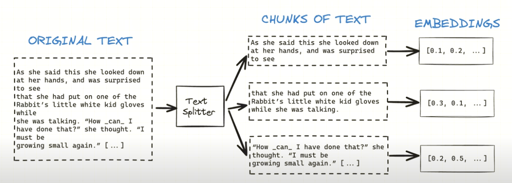

# Building a RAG application from scratch

Chat with any website using LangChain, Pinecone and Streamlit via Retrieval-Augmented Generation

Examples:

https://github.com/weaviate/Verba

https://github.com/PavloFesenko/gif_analyzer?tab=readme-ov-file#Introduction

# Table of contents

1. [Intro](#problems-of-large-pre-trained-language-models)

2. [What RAG are](#rag-retrieval-augmented-generation)

3. [Code explanation](#code-explanation)

4. [Results]()

5. [Quickstart](#deploy-the-app)

6. [References](#references)

# 🎯 Introduction

## Large Language Model (LLM)

A large language model is built to analyze and comprehend textual inputs, or prompts, and produce corresponding textual outputs, or responses. These models undergo training using a vast collection of unannotated text data, enabling them to discern linguistic structures and accumulate knowledge about words relationships. The fundamental disparity between a regular language model and a large language model lies in the magnitude of parameters employed for their operation.


Some notable LLMs are OpenAI's GPT series of models (e.g., GPT-3.5 and GPT-4, used in ChatGPT and Microsoft Copilot), Google's PaLM and Gemini (the latter of which is currently used in the chatbot of the same name), xAI's Grok, Meta's LLaMA family of open-source models, Anthropic's Claude models, and Mistral AI's open source models [11].

## Grounding LLMs to solve generation problems

Extensive pre-trained language models have demonstrated the capability to encapsulate factual information within their parameters, attaining unparalleled performance on subsequent NLP tasks when adequately fine-tuned. **Nonetheless, their proficiency in accessing and accurately manipulating this embedded knowledge remains constrained**. Therefore, in tasks that heavily rely on knowledge, their effectiveness falls short of specialized task-specific architectures. [5].

 [7]

The Retrieval-Augmented Generation (RAG) introduces a nuanced approach to handling and generating information, which can be contrasted using the "closed book" vs. "open book" analogy and explaining the advantages of "grounding".

### Closed book vs open book:
In the **closed book** paradigm, a language model generates answers based solely on the knowledge it has internalized during its training phase. It doesn't access external information or databases at the time of inference. This approach relies on the model's ability to store and recall facts, concepts, and relationships from its training data. While this can be highly effective for a wide range of tasks, the limitations are evident in terms of the freshness, specificity, and verifiability of the information provided [4].
Contrarily, the **open book** approach integrates external knowledge sources during the inference phase, allowing the model to retrieve and use the most current and relevant information for generating responses. The RAG paradigm is a prominent example of the open book approach, combining the strengths of retrieval-based and generative models to produce more accurate, reliable, and transparent outputs [4].

### Grounding:

Grounding in the context of LLMs, particularly within the RAG paradigm, refers to the model's ability to anchor its responses in real-world knowledge that can be traced back to specific sources. [4]
By leveraging external sources for information retrieval, RAG and similar models are less likely to "hallucinate" because their responses are based on existing content. This reliance on external data acts as a check against the model's propensity to generate unsupported statements.
Another significant advantage of grounding is the ability to provide citations and attributions, pointing back to the source of the information. This not only enhances the credibility of the responses but also allows users to verify the information independently. **In knowledge-intensive tasks, where accuracy and reliability are paramount, the ability to cite sources directly is a substantial benefit**.

In conclusion RAGs find their true motivation, in delimiting the LLM to act only on a limited set of data, making fine-tuning not strictly necessary, resulting in time saving and cost saving, even if there is a threshold where fine-tuning would be preferable.

# 💡 Retrieval-Augmented Generation (RAG)

A Retrieval-Augmented Generation (RAG) is a method to improve domain-specific responses of large language models [13]. The process starts with a retrieval task, searching for information semantically relevant to the user query within a specially created knowledge database. This database, known as a **vector store**, contains **embeddings (vectors)** that represent the documentation from which the model aims to extract information to include in a final enhanced prompt for the language model. The relevant context extracted in this search is then combined with the original prompt, extending the model's context window with necessary information. This preparatory step effectively increases the reliability of the model's responses by expanding the original prompt with pertinent data that the model will use to ground the response, and it is what characterizes a RAG application. A typical RAG setup consists of:

### Splitting the documentation 

Given a user query or prompt, the system searches through a knowledge source (a vector store with text embeddings) to find relevant documents or text snippets. The retrieval component typically employs some form of similarity or relevance scoring to determine which portions of the knowledge source are most pertinent to the input query [2].



### Loading the documents in a vector database: 

A vector database stores data as high-dimensional vectors, mathematical entities representing data attributes or features. These vectors, varying in dimensionality from tens to thousands, encapsulate the complexity and detail of the data, which could include text, images, audio, or video. They are created through transformations or embedding functions applied to raw data, employing techniques from machine learning, word embeddings, or feature extraction algorithms. The primary benefit of a vector database is its capability for rapid and precise similarity searches and data retrieval. Unlike traditional query methods that rely on exact matches or predefined criteria, a vector database enables searches for data that are most similar or relevant based on their semantic or contextual significance, utilizing vector distance or similarity measures [14].


### Enhancing the prompt after retrieving the relevant documents:

After enhancing the prompt with retrieved documents or snippets, these are given to a large language model. The model incorporates this additional context to generate responses that are more detailed and relevant, drawing on the factual content of the provided documents. This process allows the language model to produce answers that not only adhere more closely to the specifics of the query but also maintain a higher level of accuracy by leveraging the external information. [2].


# 🛠️ Code walkthrough

```
- __rag\_app__
   - main.py
   - requirements.txt
   - utils.py
```

## Used libraries 

The following libraries are necessary for setting up our development environment. By ensuring these tools and libraries are installed, we guarantee that our code will execute without issues, allowing our chatbot to operate as planned.

- `streamlit`: This library helps us to create interactive web apps for machine learning and data science projects.

- `streamlit_chat`
- `langchain`
- `sentence_transformers`
- `openai`
- `unstructured`
- `unstructured[pdf]`
- `pinecone-client`

## Create Vestor Store from website content

Initializing a Vector store in Pinecone -utils
```Python
from pinecone import Pinecone, ServerlessSpec

pc = Pinecone(api_key= os.environ.get('PINECONE_API_KEY'))

if index_name not in pc.list_indexes().names():
    pc.create_index(
        name=index_name,
        dimension=384,
        metric="cosine",
        spec=ServerlessSpec(
            cloud="aws",
            region="us-west-2"
        )
        )
```

Create function to create webpage chunks - utils
```Python
def create_webpage_chunks(url):

    loader = WebBaseLoader(url)
    document = loader.load()

    text_splitter = RecursiveCharacterTextSplitter(chunk_size=1000, chunk_overlap=0)
    document_chunks = text_splitter.split_documents(document)
    
    return document_chunks
```

Create the vector store from the chunks -main
```Python
from langchain.vectorstores import Pinecone as PineconeVectorStore
from sentence_transformers import SentenceTransformer

embeddings = SentenceTransformerEmbeddings(model_name="all-MiniLM-L12-v2")

website_chunks = create_webpage_chunks(website_url)

# Create the Vector Store from chuncks
docsearch = PineconeVectorStore.from_documents(website_chunks, embeddings, index_name='rag')
```

## Get a refined query

get conversation string to refine the query

The function `get_conversation_string()` loops through `st.session_state['requests']` and `st.session_state['responses']` at `[i]` and `[i+1]` simply because responses is initialised by a welcome message, therefore the correct indexing matching between requests and responses is `i` and `i+1`.

```Python
def get_conversation_string():
    conversation_string = ""
    for i in range(len(st.session_state['responses'])-1):
        conversation_string += "Human: "+ st.session_state['requests'][i] + "\n"
        conversation_string += "Bot: "+ st.session_state['responses'][i+1] + "\n"
    return conversation_string
```

The `query_refiner()` function makes use of `openai.ChatCompletion.create()` to create an enhanced query, that will increase the precision of the response to the final promt. Different roles are used to because newer models are trained to adhere to system messages. A system message is never part of the conversation and never accessible to the end-user. Therefore, it can be used to control the scope of the model’s interactions with the end-user. The user message can be used to ground the model into a specific behavior, but it cannot control it entirely. During the conversation, the user can instruct the model to contradict the statement given by the role user, as they have the same role, and the model cannot deny user asking to override their previous instructions. However, if there’s a system message, the model will give precedence to it over the user message [15].

The model is provided with a system message and with the whole history of the conversation to formulate a question relevant to th econtext. 

```Python
def query_refiner(conversation, query):
    response = openai.ChatCompletion.create(
        model="gpt-4",
        messages=[
            {"role": "system", "content": "Given the following user query and conversation log, formulate a question that would be more relevant to the context."},
            {"role": "user", "content": f"Conversation log: \n{conversation}\n\nQuery: {query}"}
        ],
        temperature=0.7,
        max_tokens=256,
        top_p=1,
        frequency_penalty=0,
        presence_penalty=0)
    return response.choices[0].message['content']
```

In the `main.py` the following call is made to create the final refined query:

```Python
with textcontainer:
        query = st.chat_input("", key="input")
        if query:
            conversation_string = get_conversation_string()
            refined_query = query_refiner(conversation_string, query)
```

## Find matches

Once we have a query, we can embed it, send it to the vector store and perform a semantic search between the query vector and the document chunks to retrieve the most relevant ones to include in the final promt. 

```Python
def find_context_chunks(input):
    input_em = model.encode(input).tolist()
    result = index.query(vector=input_em, top_k=3, include_metadata=True)
    output = []

    for i in range(0, len(result['matches'])):
        output.append(result['matches'][i]['metadata']['text'])

    return output
```

In `main.py` we get the context by calling the `find_context_chunks()` function.

```Python
context = find_context_chunks(refined_query)
```

## Feed the LLM with the final enhanced promt (Langchain)

```Python
# manage conversation memory in from of buffer
if 'buffer_memory' not in st.session_state:
    st.session_state.buffer_memory = ConversationBufferWindowMemory(
        k = 3, 
        return_messages = True)
```

```Python
system_msg_template = SystemMessagePromptTemplate.from_template(
    template="""Answer the question as truthfully as possible using the provided context, and if the answer is not contained within the text below, you can use general knowledge, but you must specify that the information are not fromthe provided context.'"""
)
```

```Python
human_msg_template = HumanMessagePromptTemplate.from_template(
    template="{input}"
    )
```

```Python
prompt_template = ChatPromptTemplate.from_messages([
    system_msg_template, 
    MessagesPlaceholder(variable_name="history"), 
    human_msg_template
    ])
```

```Python
conversation = ConversationChain(
    memory=st.session_state.buffer_memory, 
    prompt=prompt_template, 
    llm=llm, 
    verbose=True
    )
```

```Python
response = conversation.predict(
                    input=f"Context:\n {context} \n\n Query:\n{refined_query}"
                    )

st.session_state.requests.append(refined_query)
st.session_state.responses.append(response) 
```

## Loops it through as a chat

```Python
with response_container:
    if st.session_state['responses']:
        for i in range(len(st.session_state['responses'])):
            with st.chat_message("user", avatar="🔗"):
                st.write(
                    st.session_state['responses'][i],
                    key = str(i)
                    )
            if i < len(st.session_state['requests']):
                with st.chat_message("ai", avatar="💬"):
                    st.write(
                        st.session_state["requests"][i], 
                        is_user=True,
                        key = str(i) + "_user"
                        )
```
#### Langchain Memory with LLMs for Advanced Conversational AI and Chatbots

https://blog.futuresmart.ai/langchain-memory-with-llms-for-advanced-conversational-ai-and-chatbots

# 🚀 Results (the app)

# ✨ Deploy the app

## Setting Up the Environment

```
pip install -r requirements.txt
```

## Running the app

```
python -m streamlit run main.py
```
# References

1. [A](https://www.youtube.com/watch?v=bupx08ZgSFg&ab_channel=AlejandroAO-Software%26Ai)

2. [B](https://www.anaconda.com/blog/how-to-build-a-retrieval-augmented-generation-chatbot)

3. [General structure of this post](https://github.com/umbertogriffo/rag-chatbot?tab=readme-ov-file)

4. [Stanford CS25: V3 I Retrieval Augmented Language Models](https://www.youtube.com/watch?v=mE7IDf2SmJg&t=16s&ab_channel=StanfordOnline)

5. [Retrieval-Augmented Generation for Knowledge-Intensive NLP Tasks](https://doi.org/10.48550/arXiv.2005.11401)

6. [Open Source LLMs: Viable for Production or a Low-Quality Toy?](https://www.anyscale.com/blog/open-source-llms-viable-for-production-or-a-low-quality-toy)

7. [A High-level Overview of Large Language Models](https://www.borealisai.com/research-blogs/a-high-level-overview-of-large-language-models/)

8. [Contemporary Large Language Models LLMs](https://www.kaggle.com/code/abireltaief/contemporary-large-language-models-llms)

9. [AI Chip Market](https://research.aimultiple.com/ai-chip-makers/)

10. [Building an Interactive Chatbot with Langchain, ChatGPT, Pinecone, and Streamlit](https://blog.futuresmart.ai/building-an-interactive-chatbot-with-langchain-chatgpt-pinecone-and-streamlit)

11. [Large language model](https://en.wikipedia.org/wiki/Large_language_model)

12. [What is RAG? RAG + Langchain Python Project: Easy AI/Chat For Your Docs](https://www.youtube.com/watch?v=tcqEUSNCn8I&ab_channel=pixegami)

13. [Vector database](https://en.wikipedia.org/wiki/Vector_database)

14. [What is a vector database?](https://learn.microsoft.com/en-us/semantic-kernel/memories/vector-db)

15. [Purpose of the “system” role in OpenAI chat completions API](https://community.openai.com/t/purpose-of-the-system-role-in-openai-chat-completions-api/497739)

16. [Semantic Search](https://blog.dataiku.com/semantic-search-an-overlooked-nlp-superpower)

17. [Langchain Memory with LLMs for Advanced Conversational AI and Chatbots](https://blog.futuresmart.ai/langchain-memory-with-llms-for-advanced-conversational-ai-and-chatbots)