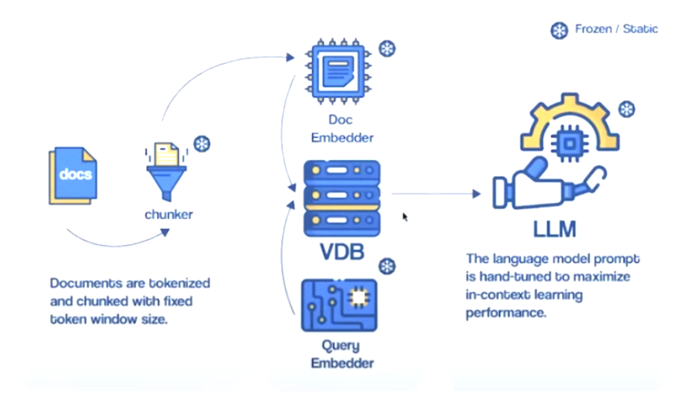

# Building a RAG application from scratch

Chat with any website using LangChain, Pinecone and Streamlit via Retrieval-Augmented Generation

Examples:

https://github.com/weaviate/Verba

https://github.com/PavloFesenko/gif_analyzer?tab=readme-ov-file#Introduction

# Table of contents

1. [Intro](#problems-of-large-pre-trained-language-models)

2. [What RAG are](#rag-retrieval-augmented-generation)

3. [Code explanation](#code-explanation)

4. [Results]()

5. [Quickstart](#deploy-the-app)

6. [References](#references)

# Introduction

## Large Language Model (LLM)

A large language model is built to analyze and comprehend textual inputs, or prompts, and produce corresponding textual outputs, or responses. These models undergo training using a vast collection of unannotated text data, enabling them to discern linguistic structures and accumulate knowledge about words relationships. The fundamental disparity between a regular language model and a large language model lies in the magnitude of parameters employed for their operation.

Some notable LLMs are OpenAI's GPT series of models (e.g., GPT-3.5 and GPT-4, used in ChatGPT and Microsoft Copilot), Google's PaLM and Gemini (the latter of which is currently used in the chatbot of the same name), xAI's Grok, Meta's LLaMA family of open-source models, Anthropic's Claude models, and Mistral AI's open source models [11].

## Grounding LLMs to solve generation problems

Extensive pre-trained language models have demonstrated the capability to encapsulate factual information within their parameters, attaining unparalleled performance on subsequent NLP tasks when adequately fine-tuned. **Nonetheless, their proficiency in accessing and accurately manipulating this embedded knowledge remains constrained**. Therefore, in tasks that heavily rely on knowledge, their effectiveness falls short of specialized task-specific architectures. [5].

 [7]

The Retrieval-Augmented Generation (RAG) introduces a nuanced approach to handling and generating information, which can be contrasted using the "closed book" vs. "open book" analogy and explaining the advantages of "grounding".

### Closed book vs open book:
In the closed book paradigm, a language model generates answers based solely on the knowledge it has internalized during its training phase. It doesn't access external information or databases at the time of inference. This approach relies on the model's ability to store and recall facts, concepts, and relationships from its training data. While this can be highly effective for a wide range of tasks, the limitations are evident in terms of the freshness, specificity, and verifiability of the information provided [4].

Contrarily, the open book approach integrates external knowledge sources during the inference phase, allowing the model to retrieve and use the most current and relevant information for generating responses. The RAG paradigm is a prominent example of the open book approach, combining the strengths of retrieval-based and generative models to produce more accurate, reliable, and transparent outputs [4].

### Grounding:

Grounding in the context of LLMs, particularly within the RAG paradigm, refers to the model's ability to anchor its responses in real-world knowledge that can be traced back to specific sources. [4]

By leveraging external sources for information retrieval, RAG and similar models are less likely to "hallucinate" because their responses are based on existing content. This reliance on external data acts as a check against the model's propensity to generate unsupported statements.

Another significant advantage of grounding is the ability to provide citations and attributions, pointing back to the source of the information. This not only enhances the credibility of the responses but also allows users to verify the information independently. **In knowledge-intensive tasks, where accuracy and reliability are paramount, the ability to cite sources directly is a substantial benefit**.

In conclusion RAGs find their true motivation, in delimiting the LLM to act only on a limited set of data, making fine-tuning not strictly necessary, resulting in time saving and cost saving, even if there is a threshold where fine-tuning would be preferable.

# Retrieval-Augmented Generation (RAG)

A Retrieval-Augmented Generation (RAG) application is a type of generative model that enhances its outputs by utilizing external documents. The process starts with a retrieval task, searching for information semantically relevant to the user query within a specially created knowledge database. This database, known as a **vector store**, contains **embeddings (vectors)** that represent the documentation from which the model aims to extract information to include in a final enhanced prompt for the language model. The relevant context extracted in this search is then combined with the original prompt, extending the model's context window with necessary information. This preparatory step effectively increases the reliability of the model's responses by expanding the original prompt with pertinent data that the model will use to ground the response, and it is what characterizes a RAG application.

Typical RAG setup:

- **Create a Vector Store for Retrieval**: Given a user query or prompt, the system searches through a knowledge source (a vector store with text embeddings) to find relevant documents or text snippets. The retrieval component typically employs some form of similarity or relevance scoring to determine which portions of the knowledge source are most pertinent to the input query [2].

- **Generation**: The retrieved documents or snippets are then provided to a large language model, which uses them as additional context for generating a more detailed, factual, and relevant response [2].

## Engineering RAG

Engineering a RAG is a complex task, and a good start is this paper:

# Code explanation

https://blog.futuresmart.ai/building-an-interactive-chatbot-with-langchain-chatgpt-pinecone-and-streamlit

https://www.youtube.com/watch?v=nAKhxQ3hcMA&ab_channel=PradipNichite

## Create Graphical User Interface

## Create Chat Component 

## Document indexing

## Semantic search (or relevant introduction for RAGs)

https://blog.dataiku.com/semantic-search-an-overlooked-nlp-superpower

## Chat interface with Streamlit

## Embeddings: OpenAIEmbeddings() or SentenceTransformerEmbeddings()?

Embeddings dimension depend from the embedding model, that has to match Pinecone Vector Store dimension

## Retrieving answers

## Langchain Memory with LLMs for Advanced Conversational AI and Chatbots

https://blog.futuresmart.ai/langchain-memory-with-llms-for-advanced-conversational-ai-and-chatbots

# Results (the app)

# Deploy the app

## Environment requirements

## Running the app

# References

1. https://www.youtube.com/watch?v=bupx08ZgSFg&ab_channel=AlejandroAO-Software%26Ai

2. https://www.anaconda.com/blog/how-to-build-a-retrieval-augmented-generation-chatbot

3. [General structure of this post](https://github.com/umbertogriffo/rag-chatbot?tab=readme-ov-file)

4. [Stanford CS25: V3 I Retrieval Augmented Language Models](https://www.youtube.com/watch?v=mE7IDf2SmJg&t=16s&ab_channel=StanfordOnline)

5. [Retrieval-Augmented Generation for Knowledge-Intensive NLP Tasks](https://doi.org/10.48550/arXiv.2005.11401)

6. [Open Source LLMs: Viable for Production or a Low-Quality Toy?](https://www.anyscale.com/blog/open-source-llms-viable-for-production-or-a-low-quality-toy)

7. [A High-level Overview of Large Language Models](https://www.borealisai.com/research-blogs/a-high-level-overview-of-large-language-models/)

8. [Contemporary Large Language Models LLMs](https://www.kaggle.com/code/abireltaief/contemporary-large-language-models-llms)

9. [AI Chip Market](https://research.aimultiple.com/ai-chip-makers/) 

10. [Building an Interactive Chatbot with Langchain, ChatGPT, Pinecone, and Streamlit](https://blog.futuresmart.ai/building-an-interactive-chatbot-with-langchain-chatgpt-pinecone-and-streamlit)

11. [Large language model](https://en.wikipedia.org/wiki/Large_language_model)

12. [What is RAG? RAG + Langchain Python Project: Easy AI/Chat For Your Docs](https://www.youtube.com/watch?v=tcqEUSNCn8I&ab_channel=pixegami)